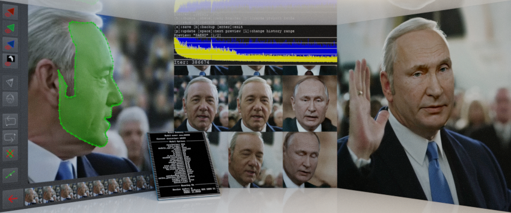
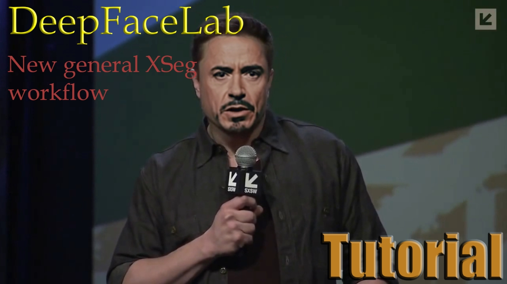
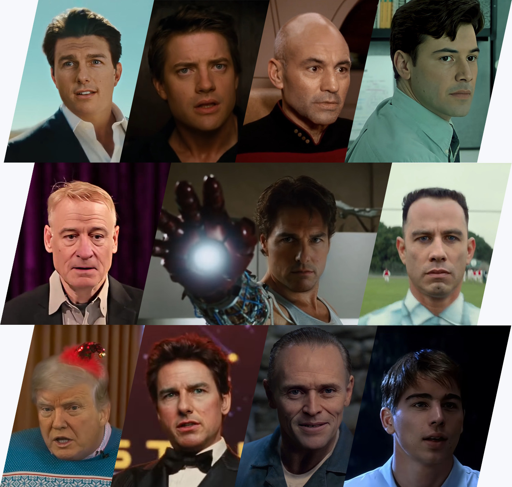

<div align="center">

# DeepFaceLab Revamped

**DeepFaceLab, rebuilt on PyTorch.**



</div>

---

DeepFaceLab is the software behind the large majority of deepfake videos made
today. This is a fork of [iperov/DeepFaceLab](https://github.com/iperov/DeepFaceLab)
whose neural-network layer has been rewritten from TensorFlow 1.x onto
**PyTorch 2.x**, so that it installs and runs on current GPUs, current drivers
and a current Python — without the frozen Python 3.6 / CUDA bundle the original
build depended on.

The user-facing workflow is unchanged. Extract, sort, label, train, merge: the
steps, the options and the on-disk formats are the ones you already know.

## What is different

| | Original build | This fork |
|---|---|---|
| Framework | TensorFlow 1.x (graph + `sess.run`) | PyTorch 2.13, eager |
| Python | 3.6.8, embedded, frozen | 3.11, provisioned by the installer |
| CUDA / cuDNN | shipped as a private copy | comes with the torch wheel |
| Distribution | a 7-Zip archive to unpack | `install.sh` / `install.bat` |
| Tensor layout | `NHWC` | `NCHW`, torch's native order |

The rewrite is a **port, not a redesign**. The layer library under
`core/leras/` keeps its API and its `.npy` on-disk weight format, so weights
trained with the original build load here unchanged — a `model/` folder from an
older installation opens as-is. What changed underneath is that layers are now
`torch.nn.Module` subclasses and execution, autograd and device handling are
torch's own.

### Models

These models are ported and available:

| Model | Purpose | Export |
|---|---|---|
| **SAEHD** | the main face-swapping model, `df` and `liae` architectures | `model.dfm` (ONNX opset 12) |
| **SAEHDX** | same architecture and weight files as SAEHD, with the training step rewritten to run faster and use less memory | `model.dfm` (ONNX opset 12) |
| **AMP** | morphable model, adjustable morph factor at merge time | `model.dfm` (ONNX opset 12) |
| **XSeg** | learned face segmentation / masking | `model.onnx` (ONNX opset 13) |

> **Quick96 is not part of this fork.** It was removed by the maintainer. For
> a quick first result, use SAEHD or SAEHDX (above) with the `df`
> architecture at a low resolution — same idea, and you keep every option
> Quick96 had fixed.

Exported `.dfm` files are consumed directly by
[DeepFaceLive](https://github.com/iperov/DeepFaceLive).

### Known limitation

**Multi-GPU training is not ported yet.** Single-GPU and CPU training both
work; `--force-gpu-idxs` selects which GPU to use.

## Requirements

- A 64-bit Windows 10/11 or Linux system, x86-64.
- An NVIDIA GPU with an up-to-date driver (`580.88` on Windows, `580.65.06` on
  Linux) for CUDA training. Without one, the installer falls back to the CPU
  build of torch — everything still works, training is just much slower.
- At least 15 GB of free disk space.
- `git`, `curl` and `tar` on the PATH. Nothing else: Python, torch and the CUDA
  runtime are all provisioned for you.

## Install

```bash
git clone https://github.com/Cioscos/DeepFaceLab-Revamped.git DeepFaceLab
cd DeepFaceLab
./install.sh          # Windows: install.bat
```

Re-running the same script is how you update. See
[README-install.md](README-install.md) for flags, the resulting folder layout,
and what to do when something goes wrong.

## The workflow

<div align="center"></div>

Once installed, the numbered scripts in `scripts/` walk through the pipeline in
order — extract frames from your two videos, extract and sort the faces, mask
them with XSeg, train, then merge the result back into a video. Four shortcuts
for the most-used steps sit at the top level.

Everything is also reachable directly through `main.py`:

```
main.py extract      --input-dir --output-dir [--detector s3fd|manual] [--face-type ...]
main.py sort         --input-dir --by blur|hist|face-yaw|origname|...
main.py train        --training-data-src-dir --training-data-dst-dir --model-dir --model <Name>
main.py merge        --input-dir --output-dir --output-mask-dir --aligned-dir --model-dir --model <Name>
main.py exportdfm    --model-dir --model <Name>
main.py videoed      extract-video | cut-video | denoise-image-sequence | video-from-sequence
main.py xseg         editor | apply | remove | remove_labels | fetch
main.py facesettool  enhance | resize
main.py util         --input-dir [--pack-faceset|--unpack-faceset|...]
```

<div align="center"></div>

## Credits

DeepFaceLab was created by **[iperov](https://github.com/iperov)**, together
with everyone who has contributed to it over the years. This fork exists only
because that work exists; the architecture, the models and the workflow are
theirs. See the upstream repository for the original documentation, the
research paper ([arXiv:2005.05535](https://arxiv.org/abs/2005.05535)) and the
full list of contributors.

## License

GPL-3.0, inherited from upstream. See [LICENSE](LICENSE).

Deepfakes are a technology with obvious potential for harm. Use this on
material you have the right to use, and do not use it to impersonate people
without their consent or to deceive anyone about what they said or did.
